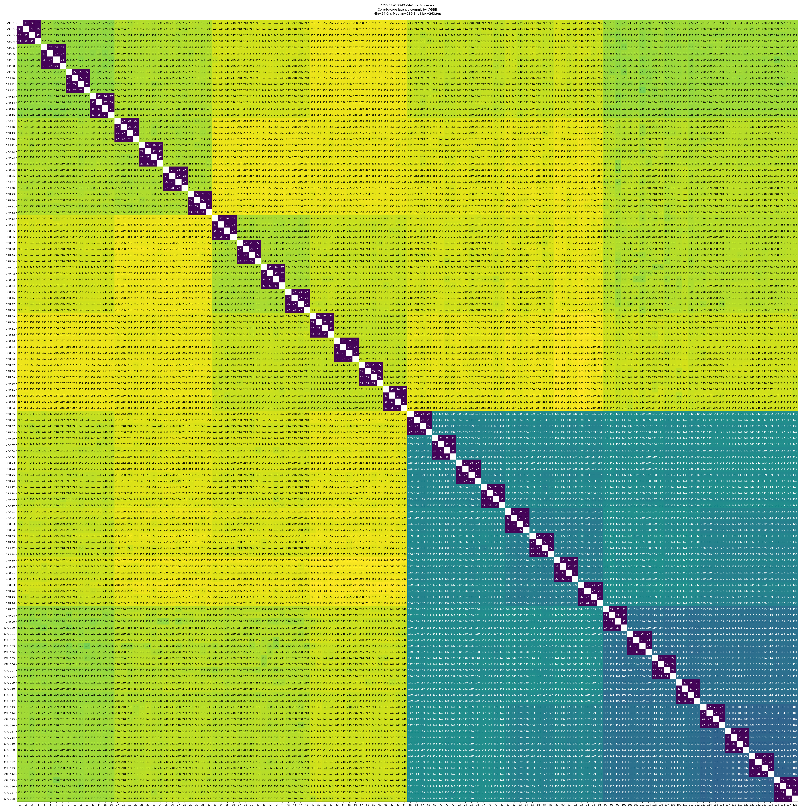
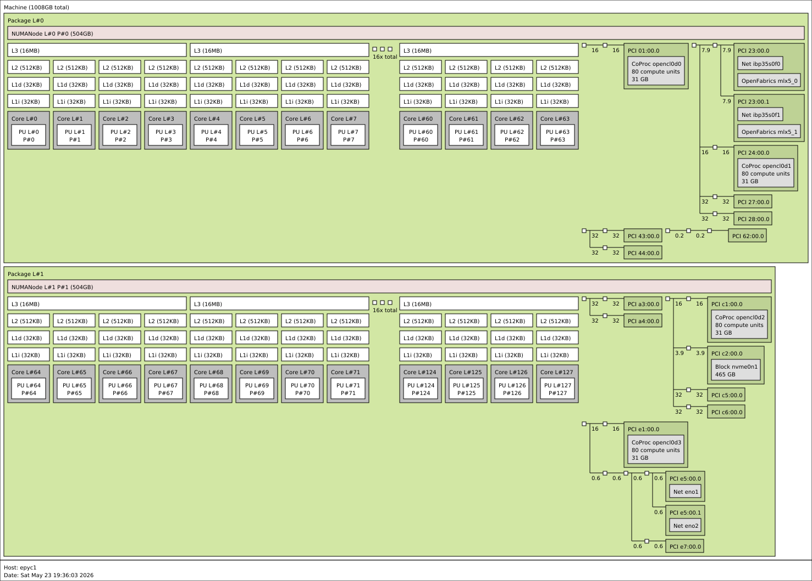

[](https://classroom.github.com/a/9aCVN0wH)
# Project 3: Molecular Dynamics Short-Range Force Computation — CPU Performance Optimization

## 0. Getting Started

Project 3 is a Coding Project, so you should accept your homework via [GitHub Classroom link](https://classroom.github.com/a/9aCVN0wH) first. This repository has starter code template.

For convenience, this year we offer you a unified Online Judge with SSH protocol. You can see below instructions to set up. But you **SHOULD ALSO** push to GitHub and then submit to Gradescope. We will review your code through Gradescope platform. But we'll use rejudge on SOJ, and use this result as final score.

**IMPORTANT NOTICE**

In order to improve your AI skills for coding, this year, we _canceled_ Top-30 score, and _allows_ you to use AI for any exploration. But we **WILL ALSO** check plagiarism. And for those who're at top-30 speed up ratio or if you received a request, you should submit your **WriteUp** to `hezb2023<at>shanghaitech.edu.cn` and `hanlt2025<at>shanghaitech.edu.cn`. If you're using AI, please attach your **complete** AI conversation flow below. We'll check carefully and share some good ideas or writeups after this project for you all to study!

## 1. Physics Background

### 1.1 Lennard-Jones Potential

Molecular Dynamics (MD) simulation numerically evolves the trajectories of a large number of particles by solving Newton's equations of motion. It is a core method in computational chemistry, materials science, and biophysics (software packages such as GROMACS, LAMMPS, and NAMD consume billions of CPU core-hours worldwide every day).

**Lennard-Jones (LJ) potential** is the most classical model for describing non-bonded interactions (van der Waals forces + short-range repulsion):

$$
U_{LJ}(r) = 4\varepsilon \left[ \left(\frac{\sigma}{r}\right)^{12} - \left(\frac{\sigma}{r}\right)^{6} \right]
$$

where:

- $r$ is the distance between two particles
- $\sigma$ determines the equilibrium distance (the potential energy minimum is at $r = 2^{1/6}\sigma$)
- $\varepsilon$ is the well depth
- The 12th-power term describes short-range electron cloud repulsion
- The 6th-power term describes long-range attraction (London dispersion force)

This project uses **reduced units**: $\varepsilon = \sigma = 1$, thus

$$
U_{LJ}(r) = 4 \left( r^{-12} - r^{-6} \right)
$$

### 1.2 Scalar Form of Force

The force on particle $i$ due to particle $j$ (along the direction $\vec{r}_{ij} = \vec{r}_i - \vec{r}_j$):

$$
\vec{F}_{ij} = -\nabla_i U_{LJ}(r_{ij}) = \frac{24}{r_{ij}^2}\left(2 r_{ij}^{-12} - r_{ij}^{-6}\right) \cdot \vec{r}_{ij}
$$

Let $f_{\text{scal}} = \dfrac{24}{r^2}\left(2 r^{-12} - r^{-6}\right)$, then $\vec{F}_{ij} = f_{\text{scal}} \cdot \vec{r}_{ij}$.

Newton's third law guarantees $\vec{F}_{ji} = -\vec{F}_{ij}$.

### 1.3 Cutoff and Periodic Boundary Conditions (PBC)

Computing interactions for all $\mathcal{O}(N^2)$ particle pairs is prohibitively expensive. Physically, the LJ potential decays very rapidly for $r > 2.5\sigma$ (approximately 1.6% of $\varepsilon$), so **cutoff** is adopted in all mainstream MD packages:

$$
U(r) = \begin{cases} U_{LJ}(r), & r < r_c \\ 0, & r \ge r_c \end{cases}, \quad r_c = 2.5
$$

To simulate an infinite system, **periodic boundary conditions** are used: particles reside in a cubic box of side length $L$, and each particle's "image copies" periodically tile all of space. The distance between two particles follows the **minimum image convention**:

$$
\Delta r_{\alpha} = \Delta r_{\alpha} - L \cdot \text{round}(\Delta r_{\alpha} / L), \quad \alpha \in \{x, y, z\}
$$

### 1.4 Cell List Acceleration to $\mathcal{O}(N)$

The box is uniformly divided into cells with side length $\geq r_c$. All neighbors within the cutoff distance of a given particle must be in its own cell or the 26 adjacent cells. The computational complexity drops from $\mathcal{O}(N^2)$ to $\mathcal{O}(N)$ (linear!), at the cost of a more complex data structure.

The baseline provided in this project already implements a cell list, but it is **inefficient** (no SIMD/OpenMP) and awaits your optimization.

---

## 2. Task Definition

Implement the function:

```c
void compute_forces_optimized(ParticleSystem *sys);
```

**Input**: `sys` already contains filled `pos[N]` (particle positions), `n` (number of particles), `box` (box side length)

**Output**: Fill `sys->force[N]` so that the net force on each particle satisfies a relative error $< 10^{-6}$ (compared with the baseline)

**Constraints**:

- Do not use numerical libraries such as BLAS / FFTW / Intel MKL
- You may only modify `src/optimized.c` and the `numactl` configuration file (see below); all other modifications will be ignored
- Do not attack or forge data

---

## 3. Input Parameters

`init_particles(N, density, seed)` places $N$ particles in a cubic box of $[0, L)^3$:

- Box side length $L = (N / \rho)^{1/3}$, where $\rho$ is the requested density
- Initial particle positions: seeded mixture of randomized, stratified layouts with minimum-spacing structure (to avoid divergent forces from overlapping particles)
- Force conservation: theoretically $\sum_i \vec{F}_i = \vec{0}$ (the evaluation will check this)

**Evaluation scales**: benchmark sizes are sampled near the nominal large scales
`2e6`, `4e6`, and `8e6`; exact sizes and seeds are chosen by the evaluator.

For each sampled size $N_i$, `bench.sh` records one measured baseline time $B_i$
without a baseline warmup. It records the best optimized time $O_i$ over 5
measured runs, after one optimized warmup. The per-size speedup is:

$$
s_i = \frac{B_i}{O_i}
$$

The final score uses the geometric mean of the per-size speedups:

$$
\text{GeoSpeedup} = \exp\left(\frac{1}{k}\sum_{i=1}^{k}\ln(s_i)\right)
$$

`bench.sh` computes `GeoSpeedup` from the full-precision per-size ratios and
rounds only the printed result to two decimals. This is equivalent to
$(s_1s_2\cdots s_k)^{1/k}$, but the log form is more numerically stable.

---

## 4. Local Testing

### 4.1 Build

```bash
make            # Compile all binaries into bin/
```

### 4.2 Correctness Verification

```bash
make correctness    # brute-force vs baseline, small scale (512, 1000, 2000)
make test N=4096    # baseline vs optimized, check force error < 1e-6
```

### 4.3 Performance Benchmark

```bash
./bench.sh
```

By default, `bench.sh` reads `seed` from `/dev/urandom` and perturbs each
nominal benchmark size by a small percentage. For reproducible local debugging,
pass an explicit seed and disable size jitter:

```bash
N_JITTER=0 ./bench.sh "2000000 4000000 8000000" 0.5 42
```

Example output:

```
=== N-body Benchmark ===
NominalSizes=2000000 4000000 8000000  density=0.5  seed=2179341566  n_jitter_pct=3  optimized_runs=5 (+ optimized warmup per size)

===============================
N=1987342  density=0.5  seed=2179341566  baseline_runs=1  optimized_runs=5 (+ optimized warmup)

[1 - Baseline]
  Run 1  : 1.234 s
  Time   : 1.234 s

[2 - Optimized]
  Warmup : done
  Run 1  : 0.456 s
  ...
  Best   : 0.440 s

[3] Correctness
...

-------------------------------
  N         : 2000000
  Baseline  : 1.234 s (single run)
  Optimized : 0.440 s (best of 5)
  Speedup   : 2.80x
-------------------------------

...

===============================
GeoSpeedup : 2.75x
Sizes      : 2000000 4000000 8000000
===============================
```

### 4.4 Common Development Commands

| Command | Description |
|---------|-------------|
| `make` | Build everything |
| `make correctness` | Small-scale correctness verification |
| `make test N=...` | Baseline vs optimized force comparison |
| `make clean` | Clean `bin/`, `tmp/`, `src/*.o` |
| `cd src && make` | Quick compile check (`-O0 -g`, for debugging) |

---

## 5. Submitting to the Evaluation System

Evaluation is conducted via SOJ (SSH-protocol Online Judge).

### 5.0 Adding SSH Public Key on Github

In the terminal, run `ssh-keygen` and press Enter throughout.

This will generate two files. Taking `/home/zambar/.ssh/id_ed25519` as an example, this is your private key—please keep it safe and never share it anywhere! And `/home/zambar/.ssh/id_ed25519.pub` is your public key.

Go to <https://github.com/settings/keys>, click `New SSH Key`, and paste your public key into the content field.

After completing the addition, ensure that running the following command locally returns normally:

```bash
ssh -T git@github.com
```

If it returns something like:

```
Hi HeZeBang! You've successfully authenticated, but GitHub does not provide shell access.
```

Then the configuration is successfully set up.

### 5.1 Configure SSH

Add the following to `~/.ssh/config`:

```
Host soj
    HostName 10.15.89.111
    Port 2222
    User [Your_Github_UserName]
```

Test the connection:

```bash
ssh soj
```

You should see the SOJ welcome message and available command prompts.

### 5.2 Upload Files

You need to upload two files using `scp` (path format: `<problemID>/<filename>`):

```bash
# Upload optimized code
scp src/optimized.c soj:proj3/optimized.c

# Upload affinity configuration
scp affinity.conf soj:proj3/affinity.conf
```

> **Note**: If `scp` reports an error, it may be due to OpenSSH version differences:
>
> - `< 8.7`: Use the `sftp` command instead
> - `8.7 ~ 9.0`: Add the `-s` option, e.g., `scp -s ...`
> - `> 9.0`: Works directly

### 5.3 Submit for Evaluation

After uploading, trigger the evaluation in the SSH shell:

```bash
ssh soj submit proj3
```

Check submission status:

```bash
ssh soj list          # List all submissions
ssh soj status <id>   # View details of a specific submission
```

### 5.4 affinity.conf Description

To provide the most realistic tuning experience, we allow you to modify `numactl` runtime parameters via a configuration file. You can look up relevant documentation to understand how this works and how to optimize your program's execution.

`affinity.conf` controls how `numactl` binds CPUs/memory. The format is `key = value`, one entry per line:

```ini
# CPU binding (choose at most one)
physcpubind = 0-127         # Specify physical CPU range
cpunodebind = 0             # Specify NUMA node

# Memory binding (choose at most one)
membind     = 0             # Only allocate from specified node
interleave  = 0,1           # Round-robin allocation across nodes
preferred   = 0             # Prefer a node, but allow spillover
localalloc  = true          # Allocate on the node where the CPU resides
```

Leave empty to disable `numactl`, letting the kernel scheduler choose CPUs. See `affinity.conf.example` for reference.

## 6. Grading Criteria

Scores are computed based on the **geometric mean speedup** using piecewise linear interpolation:

| Speedup (GeoSpeedup) | Score |
|-----|-------|
| 0x | 0% |
| 1x | 20% |
| 10x | 30% |
| 20x | 40% |
| 30x | 50% |
| 40x | 60% |
| 50x | 80% |
| 85x+ | 100% |

Between key points, the score is linearly interpolated. Examples:

- 5x speedup → 25% (midpoint between 1x at 20% and 10x at 30%)
- 15x speedup → 35% (midpoint between 10x at 30% and 20x at 40%)

**Compilation error or wrong answer** results in 0 points regardless of speedup.

## 7. Appendix

### Evaluation Machine Specifications

Both our submission server and final evaluation machine run on this AMD EPYC machine, so the following information may be helpful.

#### `lscpu`

```
Architecture:                            x86_64
CPU op-mode(s):                          32-bit, 64-bit
Address sizes:                           43 bits physical, 48 bits virtual
Byte Order:                              Little Endian
CPU(s):                                  128
On-line CPU(s) list:                     0-127
Vendor ID:                               AuthenticAMD
Model name:                              AMD EPYC 7742 64-Core Processor
CPU family:                              23
Model:                                   49
Thread(s) per core:                      1
Core(s) per socket:                      64
Socket(s):                               2
Stepping:                                0
Frequency boost:                         enabled
CPU max MHz:                             2250.0000
CPU min MHz:                             1500.0000
BogoMIPS:                                4500.19
Flags:                                   fpu vme de pse tsc msr pae mce cx8 apic sep mtrr pge mca cmov pat pse36 clflush mmx fxsr sse sse2 ht syscall nx mmxext fxsr_opt pdpe1gb rdtscp lm constant_tsc rep_good nopl nonstop_tsc cpuid extd_apicid aperfmperf rapl pni pclmulqdq monitor ssse3 fma cx16 sse4_1 sse4_2 movbe popcnt aes xsave avx f16c rdrand lahf_lm cmp_legacy svm extapic cr8_legacy abm sse4a misalignsse 3dnowprefetch osvw ibs skinit wdt tce topoext perfctr_core perfctr_nb bpext perfctr_llc mwaitx cpb cat_l3 cdp_l3 hw_pstate ssbd mba ibrs ibpb stibp vmmcall fsgsbase bmi1 avx2 smep bmi2 cqm rdt_a rdseed adx smap clflushopt clwb sha_ni xsaveopt xsavec xgetbv1 xsaves cqm_llc cqm_occup_llc cqm_mbm_total cqm_mbm_local clzero irperf xsaveerptr rdpru wbnoinvd amd_ppin arat npt lbrv svm_lock nrip_save tsc_scale vmcb_clean flushbyasid decodeassists pausefilter pfthreshold avic v_vmsave_vmload vgif v_spec_ctrl umip rdpid overflow_recov succor smca sme sev sev_es ibpb_exit_to_user
Virtualization:                          AMD-V
L1d cache:                               4 MiB (128 instances)
L1i cache:                               4 MiB (128 instances)
L2 cache:                                64 MiB (128 instances)
L3 cache:                                512 MiB (32 instances)
NUMA node(s):                            2
NUMA node0 CPU(s):                       0-63
NUMA node1 CPU(s):                       64-127
```

#### Core-to-Core Latency



#### Topology



---

If you have questions about the problem or evaluation machine, you can contact:

- Any course instructor
- `hezb2023<at>shanghaitech.edu.cn`
- `hanlt2025<at>shanghaitech.edu.cn`
